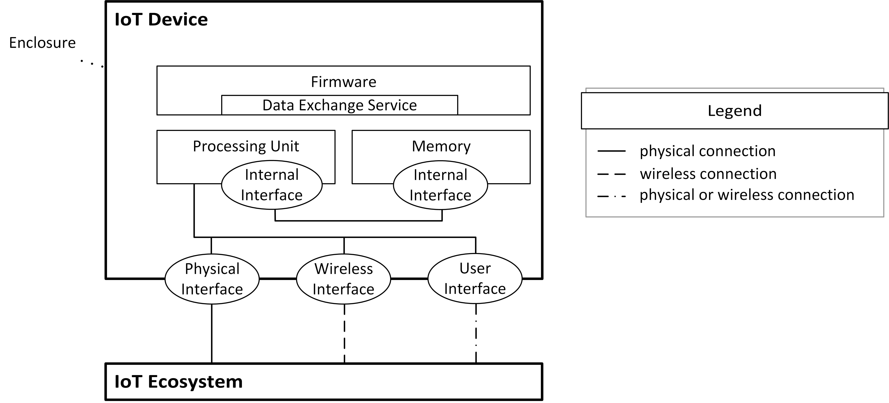

# 2.1. IoT Device Model

This chapter will focus on the IoT device model representing the general structure of IoT devices. Creating the device model is the first step in order to achieve the goals defined in the solution approach (see [1. Introduction](../01_introduction/README.md)). All further steps, which will be described in [2.2. Attacker Model](./attacker_model.md), [2.3. Methodology](./methodology.md) and [3. Test Case Catalog](../03_test_cases/README.md), will be based on the device model.

## Related Work

The device model was built upon a reference architecture for IoT platforms. Furthermore, potential attack vectors in the form of attack surface areas were also taken into account since the device model will be used in a security context. These are outlined by the following related work:

-   **["Comparison of IoT Platform Architectures: A Field Study based on a Reference Architecture"][reference_architecture]:** The aim of this paper is to propose a reference architecture for IoT ecosystems. This reference architecture was "kept \[\...\] abstract on purpose since the aim of \[the\] reference architecture is to serve as a uniform, abstract terminology, which eases the comparison of different platforms" ([source][reference_architecture]). As the device model developed in this guide should also serve as a uniform model for different IoT devices, independent of specific implementations and designs, the reference model after Guth et al. ([source][reference_architecture]) was taken as a basis. Nevertheless, the model after Guth et al. ([source][reference_architecture]) is superficial in terms of the IoT device itself. It depicts the device as a single component without further differentiation of its parts (besides drivers). Thus, it is not sufficient for this guide since it does not allow a fine-grained definition of the test scope (inclusion and exclusion of specific device parts). In the model introduced in this guide some adjustments were made in order to further differentiate individual parts of IoT devices.

-   **["IoT Attack Surface Areas Project"][owasp_iot_attack_surface_areas]:** OWASP regularly publishes penetration testing methodologies and collections of popular security risks (called "OWASP Top 10") in several technical fields, such as web and mobile application security. Due to its popularity, it has become one of the major sources for information regarding penetration testing. In 2014 and 2018, OWASP has also published a top 10 of security risks regarding the IoT field. The surface areas mentioned in the "IoT Attack Surface Areas Project" represent parts of an IoT solution which might be targeted by potential attackers. Due to the fact that this list already covers many potential attack vectors in regards to IoT devices and IoT ecosystems in general, it was also used as a basis for the device model proposed within this guide. However, some adjustments were made in order to further differentiate the details of IoT device implementations, especially in terms of the hardware side. Furthermore, the "IoT Attack Surface Areas Project" only consists of a simple list of device parts, which does not specify how these parts interact with each other. It also misses to define the characteristics of each device part (or respectively the attack surface area) and thus makes it difficult to differentiate them, e.g., "Device Memory" and "Local Data Storage". ([source][owasp_iot_attack_surface_areas])

## Device Boundaries

In order to distinguish between components belonging to an IoT device and components of the surrounding IoT ecosystem, it is necessary to first define the boundaries of an IoT device. An IoT device is generally encompassed by an enclosure of some kind, which (physically) separates device-internal lements from device-external elements.

Interactions between internal and external elements are only possible via interfaces. Within this guide, these interfaces are not considered to be part of the enclosure. Instead, those interfaces will be categorized individually (see [Interfaces](#interfaces)).

As will be explained in the next section, the term "component" refers to an item that can be the subject of a penetration test. Thus, device-internal elements and interfaces are considered components within this guide.

## Components

As introduced in the previous sections, the proposed device model should provide a generalized selection of parts that IoT devices consist of. These parts will be referred to as components. Every component is a piece of soft- and/or hardware that, in theory, can be tested individually. The penetration test scope for an IoT device can therefore be defined as a list of components.

### Device-Internal Elements

Every device-internal element is a component residing inside the device enclosure. Thus, they are part of the IoT device. IoT devices usually comprise the following internal elements, all of which are mentioned in the list of attack surfaces composed by OWASP ([source][owasp_iot_attack_surface_areas]):

- **Processing unit:** The processing unit, also called processor, is responsible for managing and performing data processing tasks. These tasks are defined as a sequence of instructions that are loaded from the memory. A device has at least a central processing unit handling its core functionalities (defined by the firmware). However, more complex devices might also be equipped with further processing units that are assigned to specific subtasks. A special kind of processor are microprocessors, built on a single circuit. Microcontrollers are microprocessors, which also have analog and digital in- and outputs. They are typically used to control the behavior of a device and are often used in the embedded field. ([source][ekomp_processor])

  *Examples: x86 processor, ARM processor, AVR processor*

- **Memory:** Memory is used to store data, such as programs (instructions for a processing unit) and information, in binary form. Depending on the type of memory, it is used to temporarily store data while being processed by a processing unit (primary memory or cache) or to permanently store data on a device even while the device is turned off (secondary memory). A special kind of secondary memory is flash memory. It is commonly used in many devices because it is energy-saving, develops less heat and is less susceptible to vibration and magnetic fields due to the lack of moving parts. Flash memory is based on semiconductor technology and able to provide fast and permanent access to data (read, write, delete). ([source][ekomp_flash_memory], [source][ekomp_memory])

  *Examples: EEPROM, flash memory*

- **Firmware:** "Firmware is a software program or set of instructions programmed on a hardware device" ([source][tech_terms_firmware]). It is used to control the device and the communication between device-internal and -external elements (data in- and output via data exchange services). Firmware is stored on a memory and executed by a processing unit. In regards of device firmware, the following components might be potential targets for a penetration test:

  -   **Installed firmware:** Installed firmware refers to firmware that is already installed on a device. It might be the target of dynamic analyses and usually handles the storage and processing of sensitive user data.

  -   **Firmware update mechanism:** A firmware update mechanism is part of the firmware and defines how firmware updates, in the form of firmware packages, can be installed on a device. A crucial responsibility of a firmware update process is to ensure that only proper firmware packages can be installed and executed.[^1]

  *Examples: OS, RTOS, bare-metal embedded firmware*

- **Data exchange service:** Data exchange services refer to programs or parts of programs, used to transfer data between two or more components via an interface (e.g., network, bus). These services are part of the firmware and can be used to transmit data, receive data or both.

  *Examples: network service, debug service, bus listener*

[^1]: For performing a test of a firmware update mechanism, a firmware package is required. Due to the fact that a firmware package could also be inspected separately, it could be considered a component as well. However, since this guide focuses on device-internal elements and device interfaces only, firmware packages are not in scope. Contrary to installed firmware, an update package also includes the firmware header, which might include important data.

### Interfaces

Interfaces are required to connect two or more components with each other. Interactions between device-internal elements or between device-internal and device-external elements are only possible via interfaces. Based on which components are connected by an interface, it can be categorized as a machine-to-machine or human-to-machine interface. As long as at least one of the connected components is a device-internal element, the interface itself is also part of the device.

Within this guide, the following kinds of interfaces will be differentiated, all of which are either directly or indirectly mentioned in the list of attack surfaces, composed by OWASP ([source][owasp_iot_attack_surface_areas]):

- **Internal interfaces (machine-to-machine):** These interfaces are used to establish a connection between device-internal elements and are not accessible from outside the device enclosure.

  *Examples: JTAG, UART, SPI*

- **Physical interfaces (machine-to-machine):** Physical interfaces  are used to establish a connection between device-internal and -external elements, based on a physical connection between the components or the respective interfaces of those components. Therefore, physical interfaces require a socket or a port, built into the device enclosure and thus are accessible from outside the device.

  *Examples: USB, Ethernet*

- **Wireless interfaces (machine-to-machine):** Similar to physical interfaces, wireless interfaces are also used to establish a connection between device-internal and -external elements. However, the connection between wireless interfaces is not based on a physical connection, but on radio waves, optical signals or other wireless technologies. Wireless interfaces are accessible from outside the device, usually from a greater distance than physical interfaces.

  *Examples: Wi-Fi, Bluetooth, BLE, ZigBee*

- **User interfaces (human-to-machine):** In contrast to all other above-mentioned interfaces, user interfaces are not utilized to establish a connection between two machines. Instead, their purpose is to allow interactions between device-internal elements and a user. These interactions can either be based on a physical connection, e.g., in case of a touch display, or wireless connections, e.g., in case of a camera or microphone.

  *Examples: touch display, camera, microphone, local web application (hosted on the device)*

## Device Model Scheme

The device model is a combination of all above-mentioned components and can be seen in the figure below. It must be noted that, even though cardinalities were not included for better readability, more than one instance of each component might be built into an IoT device. 

Other models, e.g., the ones mentioned in [Related Work](#related-work), include sensors and actors as components of a device. Within this guide, sensors and actors are considered physical, wireless or user interfaces respectively because they enable interactions between device-internal and -external elements or users via physical (e.g., touch sensor, door control) or wireless connections (e.g., microphone, temperature sensor).

In some cases, it is also possible that devices comprise parts which can be considered devices themselves (i.e., nested devices). It then depends on the perspective of the observer which interfaces are classified as internal and external. The determining factor are the boundaries between the observer and the interface (see [Device Boundaries](#device-boundaries), [Device-Internal Elements](#device-internal-elements) and [Interfaces](#interfaces)).

Overall, the device model, which was specifically developed in the context of this guide, can be used to create and share abstract representations of various different IoT devices. Contrary to other models, this one solely focuses on the IoT device and the components it is built of. Hence, the model allows to describe device implementations in a more detailed manner. In combination with the models and concepts, developed in the following chapters, it is possible to compile a list of applicable test cases for any given device regardless of the specific technologies or standards that are implemented.

[reference_architecture]: https://ieeexplore.ieee.org/document/7872918	"Comparison of IoT platform architectures: A field study based on a reference architecture"
[owasp_iot_attack_surface_areas]: https://wiki.owasp.org/index.php/OWASP_Internet_of_Things_Project#tab=IoT_Attack_Surface_Areas	"OWASP IoT Attack Surface Areas Project"
[tech_terms_firmware]: https://techterms.com/definition/firmware	"TechTerms.com"
[ekomp_processor]: https://www.elektronik-kompendium.de/sites/com/0309161.htm	"CPU - Central Processing Unit / Hauptprozessor"
[ekomp_flash_memory]: https://www.elektronik-kompendium.de/sites/com/0312261.htm	"Flash-Speicher / Flash-Memory"
[ekomp_memory]: https://www.elektronik-kompendium.de/sites/com/1812051.htm	"Speicherarchitektur"
