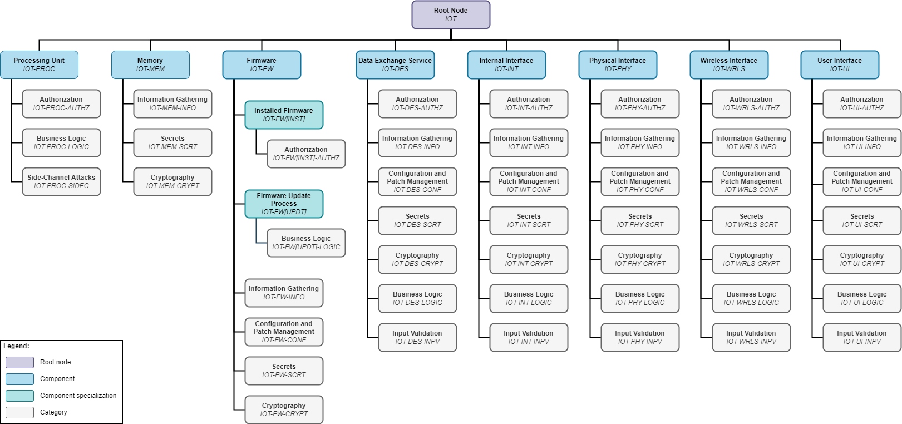

# 2.3. Testing Methodology

In this chapter, a methodology for performing IoT device penetration tests will be described. It is based on the concepts, presented in [2.1. IoT Device Model](./device_model.md) and [2.2. Attacker Model](./attacker_model.md) and serves as a supplement, which can be used with pre-existing penetration testing workflows and frameworks. The methodology comprises key aspects of testing that have to be performed during an IoT device penetration test. Therefore, it includes a catalog of test cases for each individual device component. As described in the previous chapters, the specific selection of applicable test cases depends on the results of applying the device and attacker models, which have been designed in the context of this methodology.

At first, it will be described how this methodology can be integrated into other workflows and during which steps the models and concepts of this methodology can be used. Then, selected testing techniques will be explained, which can be applied during the test and are not restricted to certain test cases. Finally, the structural concept of the catalog of test cases will be explained.

In comparison to other IoT penetration testing frameworks, this methodology follows a more generic yet comprehensive approach. It defines test cases for certain security issues that are relevant in the IoT context (key aspects of testing) without being restricted by the details of specific technologies or standards. Thereby, this methodology is more flexible than other frameworks, which is an important benefit given the volatility of the IoT field. Nonetheless, the methodology is applicable to various technologies and provides possibilities for further particularizations.

It must be noted that test cases, which apply to multiple components, will not be included in this chapter. The full list of test cases can be found in [3. Test Case Catalog](../03_test_cases/README.md).

## Integration Into Other Workflows and Frameworks

To achieve efficiency, no major adjustments to any pre-existing workflows should be required to incorporate this methodology. In the following, it will be shown how this methodology can be integrated into other frameworks based on the example of the BSI penetration testing model ([source][bsi_pentest]). In this case, no changes to the overall test workflow are required.

The methodology proposed in this guide can be used to facilitate the following steps:

-   **Clarification of the Test Scope and Test Perspective:** The methodology supports the clarification of test objectives and conditions with the contractee during phases 1 and 3 of the BSI model ([source][bsi_pentest]) by establishing a common terminology in form of the device and attacker models, thus facilitating the communication. Furthermore, the device model supports the testing team during phase 2 by providing a generic scheme, which can be compared to the architecture of a given IoT device in order to identify potential attack vectors.

-   **Test Execution and Documentation:** The catalog of test cases acts as a guideline for testers during the active test (phase 4 of the BSI model ([source][bsi_pentest])). Depending on the test scope and test perspective, applicable test cases are defined, which have to be performed during the test. Thus, the test catalog can be used as a checklist to ensure that all mandatory tests were performed. It also allows to transparently document the test procedure in a reproducible manner during phase 5, due to the fact that performed test cases can be referenced in the report.

## Description of the Hierarchic Structure

In the following, the overall structure of the test case catalog as well as the general layout of a test case will be defined.

### Structure of the Catalog of Test Cases

The catalog of test cases will follow a hierarchic (tree) structure. Starting from a single root node (IOT), each component of the device model will be represented as a child node, thereby forming its own subtree. Subsequently, further nodes will be added as children to the component nodes, eventually resulting in each test case being a leaf node. A unique identifier, incorporating this structure, will be assigned to each node, allowing to reference it in the test report or other documents.

The following hierarchic levels and types of nodes are defined:

- **Component:** The first main hierarchy level is the component (see [2.1. IoT Device Model](./device_model.md)). The type of component (device-internal element/interface) was not included in the hierarchy for the sake of simplicity and due to the lack of added value.

  *Short representation: 2 - 5 uppercase alphabetic characters*

  *Examples: ISTG-PROC, ISTG-MEM, ISTG-FW, ISTG-DES, ISTG-INT, ISTG-PHY, ISTG-WRLS, ISTG-UI*

- **Component Specialization (Optional):** Optional component specializations can be used to define test cases that are only relevant for certain parts or exemplars of a component (e.g., installed firmware - ISTG-FW[INST] - as specialization for the component firmware - ISTG-FW - or SPI - ISTG-INT[SPI] - as specialization for the component internal interface - ISTG-INT).

  By default, component specializations inherit all categories and test cases, defined for their parent node (e.g., all test cases defined for the component firmware - ISTG-FW - are inherited by the specialization installed firmware - ISTG-FW[INST]).

  If required, it is allowed to chain specializations, for example over-the-air firmware updates - ISTG-FW\[UPDT][OTA] - as specialization of firmware update - ISTG-FW[UPDT]. In this case, the second specialization inherits all categories and test cases, defined for the first specialization, thus also inheriting all test cases, defined for the component in general.

  Furthermore, if required, it is also allowed to define a list of categories or test cases, which should be excluded from being inherited by a component specialization.

  *Short representation: 2 - 5 uppercase alphabetic characters in square brackets*

  *Examples: ISTG-FW[INST], ISTG-FW[UPDT]*

- **Category:** The second main hierarchy level is the category, which can be used to group test cases, e.g., all test cases related to authorization can be grouped in the category AUTHZ.

  *Short representation: 2 - 5 uppercase alphabetic characters*

  *Examples: ISTG-\*-AUTHZ, ISTG-\*-INFO, ISTG-\*-CONF*

- **Test Case:** The third main hierarchy level is the test case. See [3. Test Case Catalog](../03_test_cases/README.md) for more details.

  *Short representation: three-digit incremental number of the test case.*

  *Examples: ISTG-FW-INFO-001, ISTG-FW-INFO-002, ISTG-FW-INFO-003*

This kind of structure allows to efficiently determine applicable subtrees by deselecting nodes (e.g., components, component specializations and categories) that are not relevant for a given device or test scenario. The table below shows an exemplary list of nodes for each hierarchy level. An overview of all components and categories that are included in this guide can be seen in the figure below the table.

The usage of component and category specializations allows to expand the catalog of general test cases to include test cases for specific standards and technologies. By inheriting test cases from their parent nodes, it is ensured that these test cases are also applied to the child nodes by default. However, at the time of writing this guide, the possibility that test cases of a parent node might not be applicable to a child node in particular cases could not be precluded. Thus, it is allowed to specify a list of test cases, which are excluded from being inherited by a certain child node.

Another way to expand the catalog is to add custom components, categories and test cases. This way, the methodology could also be expanded to include further components, e.g., device-external elements of the IoT ecosystem.

<table>
    <thead>
        <tr>
            <th>Hierarchy Level</th>
            <th>ID</th>
            <th>Description</th>
        </tr>
    </thead>
    <tbody>
        <tr>
            <td>0</td>
            <td>IOT</td>
            <td>Root Node</td>
        </tr>
        <tr>
            <td rowspan="14" valign="top">1</td>
            <td colspan="2"><b>Component</b></td>
        </tr>
        <tr>
            <td>ISTG-PROC</td>
            <td>Processing Unit</td>
        </tr>
        <tr>
            <td>ISTG-MEM</td>
            <td>Memory</td>
        </tr>
        <tr>
            <td>ISTG-FW</td>
            <td>Firmware</td>
        </tr>
        <tr>
            <td>ISTG-DES</td>
            <td>Data Exchange Service</td>
        </tr>
        <tr>
            <td>ISTG-INT</td>
            <td>Internal Interface</td>
        </tr>
        <tr>
            <td>ISTG-PHY</td>
            <td>Physical Interface</td>
        </tr>
        <tr>
            <td>ISTG-WRLS</td>
            <td>Wireless Interface</td>
        </tr>
        <tr>
            <td>ISTG-UI</td>
            <td>User Interface</td>
        </tr>
        <tr>
            <td>ISTG-*</td>
            <td>Custom Component <i>(placeholder for future extensions)</i></td>
        </tr>
        <tr>
            <td colspan="2"><b>Component Specialization (Optional)</b></td>
        </tr>
        <tr>
            <td>ISTG-FW[INST]</td>
            <td>Installed Firmware</td>
        </tr>
        <tr>
            <td>ISTG-FW[UPDT]</td>
            <td>Firmware Update Mechanism</td>
        </tr>
        <tr>
            <td>ISTG-*[*]</td>
            <td>Custom Component Specialization <i>(placeholder for future extensions)</i></td>
        </tr>
        <tr>
            <td rowspan="10" valign="top">2</td>
            <td colspan="2"><b>Category</b></td>
        </tr>
        <tr>
            <td>ISTG-*-AUTHZ</td>
            <td>Authorization</td>
        </tr>
        <tr>
            <td>ISTG-*-INFO</td>
            <td>Information Gathering</td>
        </tr>
        <tr>
            <td>ISTG-*-CRYPT</td>
            <td>Cryptography</td>
        </tr>
        <tr>
            <td>ISTG-*-SCRT</td>
            <td>Secrets</td>
        </tr>
        <tr>
            <td>ISTG-*-CONF</td>
            <td>Configuration and Patch Management</td>
        </tr>
        <tr>
            <td>ISTG-*-LOGIC</td>
            <td>Business Logic</td>
        </tr>
        <tr>
            <td>ISTG-*-INPV</td>
            <td>Input Validation</td>
        </tr>
        <tr>
            <td>ISTG-*-SIDEC</td>
            <td>Side-Channel Attacks</td>
        </tr>
        <tr>
            <td>ISTG-*-*</td>
            <td>Custom Category <i>(placeholder for future extensions)</i></td>
        </tr>
        <tr>
            <td rowspan="5" valign="top">3</td>
            <td colspan="2"><b>Test Case</b></td>
        </tr>
        <tr>
            <td>ISTG-*-INFO-001</td>
            <td>Disclosure of Source Code</td>
        </tr>
        <tr>
            <td>ISTG-*-INFO-002</td>
            <td>Disclosure of Implementation Details</td>
        </tr>
        <tr>
            <td>ISTG-*-INFO-003</td>
            <td>Disclosure of Ecosystem Details</td>
        </tr>
        <tr>
            <td>ISTG-*-*-*</td>
            <td>Custom Test Case <i>(placeholder for future extensions)</i></td>
        </tr>
    </tbody>
</table>

### Structure of Test Cases

Each individual test case, which is represented by a leaf node, is divided into the following sections:

-   **Requirements:** The requirements section will define which physical and authorization access levels are required to carry out the test case. Since these requirements also depend on the given test conditions, e.g., the specific implementation of the target device and its operational environment, a range of access levels might be defined which apply to the test case in general.

-   **Summary:** The summary section includes an overall description of the security issue, which the test case is based on.

-   **Test Objectives:** In the test objectives section, a list of checks that the tester has to perform is given. By performing these checks, the tester can determine whether the device is affected by the security issue described in the summary.

-   **Remediation:** The remediation section comprises recommendations regarding potential measures that can be applied to solve the security issue. However, these recommendations are only rough suggestions. It is the responsibility of the manufacturer/operator to derive detailed measures in regards of the device implementation.

[bsi_pentest]: https://www.bsi.bund.de/SharedDocs/Downloads/EN/BSI/Publications/Studies/Penetration/penetration_pdf.pdf?__blob=publicationFile&v=1	"Study: A Penetration Testing Model"
[nvd]: https://nvd.nist.gov	"National Vulnerability Database"
[owasp_fuzzing]: https://owasp.org/www-community/Fuzzing	"Fuzzing"

